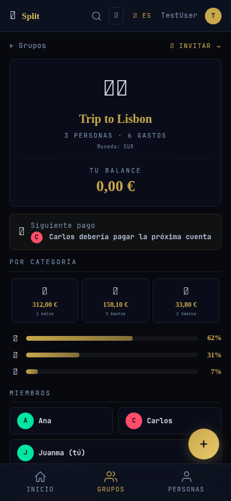
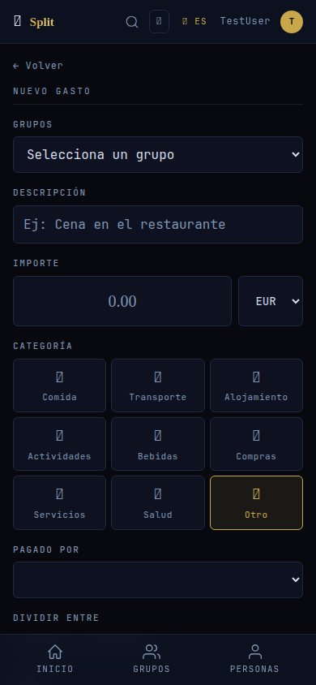
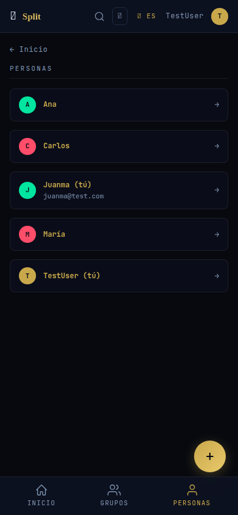

# Split — Self-hosted expense splitter

**Split** is a privacy-first expense sharing app you run on your own server. No subscriptions, no ads, no data harvesting — just a clean way to split bills with friends and family.

> **Stack:** SvelteKit + SQLite · **Deploy:** Docker, Home Assistant, or any Node.js host

---

## Screenshots

| Login | Dashboard | Groups |
|:-----:|:---------:|:------:|
|  |  |  |

| Group Detail | Add Expense | People |
|:------------:|:-----------:|:------:|
|  |  |  |

---

## Features

### Core
- **Multi-currency** — Record expenses in any of 33 currencies. Each person's debt is converted to their base currency at the historical exchange rate (ECB), so nobody takes a hit if rates change.
- **Debt simplification** — Greedy algorithm reduces N×M possible transfers to the minimum. In a group of 4 with 12 messy IOUs, you might end up with just 3 clean payments.
- **Recurring expenses** — Mark an expense as weekly, monthly, or yearly. Split generates the next 12 instances automatically.
- **Item-level splitting** — Don't just split the total. Add line items (€15 pizza, €8 wine) and assign each to specific people.
- **Partial settlements** — Settle up for any amount, not just the full balance.

### UX
- **Offline PWA** — Add expenses without internet. The service worker queues them in IndexedDB and syncs when you're back online.
- **EN / ES** — Full Spanish and English support. Toggle in the header. Preference stored locally.
- **Three themes** — Dark navy (default), OLED true black, warm light. Tap the palette icon in the header.
- **Invite links** — Share a `/groups/{id}/join` link. Anyone with the link joins the group instantly.
- **CSV export** — Download a group's full expense history as a CSV file.

### Technical
- **No backend setup** — SQLite + Node.js. One command to run.
- **Self-hosted fonts** — JetBrains Mono for UI, Libre Baskerville for numbers. No Google Fonts dependency.
- **Service worker** — Network-first for pages, cache-first for assets. Works offline.
- **33 currencies** — EUR, GBP, USD, CHF, JPY, CAD, AUD, NZD, SEK, NOK, DKK, PLN, CZK, HUF, RON, BGN, HRK, TRY, BRL, MXN, CNY, INR, KRW, THB, SGD, HKD, ZAR, AED, ILS, PHP, TWD, MYR, IDR

---

## Quick Start

```bash
git clone https://github.com/jsr1292/split.git
cd split
npm install
npm run dev
```

Open [http://localhost:3480](http://localhost:3480), create your account, and start splitting.

---

## Production Deploy

### Docker

```bash
docker build -t split .
docker run -d -p 3480:3480 -v $(pwd)/data:/app/data split
```

Or with Docker Compose:

```bash
docker compose up -d
```

### Home Assistant Addon

The `ha-addon/` directory contains a Home Assistant addon configuration with Ingress support. Point your addon repository to this directory.

### GitHub Actions

Push a version tag to trigger the CI/CD pipeline:

```bash
git tag v1.0.0
git push origin v1.0.0
```

Builds `amd64` + `arm64` images and pushes to `ghcr.io/jsr1292/split`.

---

## Environment Variables

| Variable | Default | Description |
|----------|---------|-------------|
| `PORT` | `3480` | Server port |
| `SESSION_SECRET` | (auto-generated) | Session signing key. Set a persistent one for production. |
| `NODE_ENV` | `development` | Set to `production` for production builds. |

---

## API

All API routes are under `/api/`:

| Method | Path | Description |
|--------|------|-------------|
| `POST` | `/api/auth/login` | Login with email + password |
| `POST` | `/api/auth/register` | Create account |
| `POST` | `/api/auth/logout` | Logout |
| `GET` | `/api/currencies` | List supported currencies |
| `GET/POST` | `/api/rates` | Fetch exchange rates from ECB |
| `GET` | `/api/search?q=` | Search groups, expenses, people |
| `GET/POST` | `/api/groups/{id}` | Group CRUD |
| `POST` | `/api/settle` | Record a settlement payment |
| `POST` | `/api/groups/{id}/export` | Download group expenses as CSV |
| `DELETE` | `/api/expenses/{id}` | Delete an expense |

---

## Tech Stack

| Layer | Choice |
|-------|--------|
| UI | SvelteKit (Svelte 5) |
| Database | SQLite + better-sqlite3 |
| Auth | Session cookies + scrypt hashing |
| Styling | Custom CSS — dark glassmorphism |
| i18n | JSON-based, EN/ES |
| Fonts | Self-hosted (JetBrains Mono, Libre Baskerville) |
| PWA | Service worker + IndexedDB offline queue |
| Build | adapter-node for standalone production |
| CI/CD | GitHub Actions — multi-arch Docker builds |

---

## Project Structure

```
split/
├── src/
│   ├── lib/
│   │   ├── i18n/          # Translations (en.json, es.json)
│   │   └── server/
│   │       ├── auth/       # Session + password handling
│   │       ├── currency.ts # ECB exchange rates
│   │       └── db/         # SQLite queries
│   └── routes/
│       ├── api/           # REST endpoints
│       ├── auth/          # Login, register
│       ├── expense/       # Add, view, edit expenses
│       ├── groups/        # Groups, members, settle up
│       ├── people/        # Person detail, balances
│       └── search/        # Full-text search
├── static/
│   ├── fonts/             # Self-hosted typefaces
│   └── sw.js              # Service worker
├── ha-addon/              # Home Assistant addon config
├── Dockerfile
├── docker-compose.yml
└── .github/workflows/build.yml
```

---

## License

MIT
