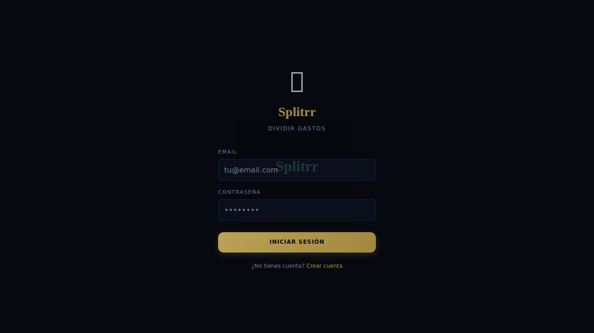
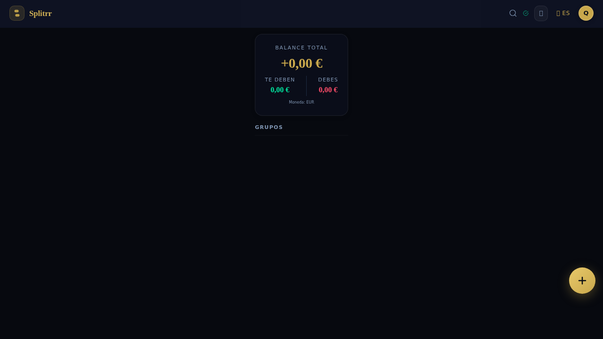
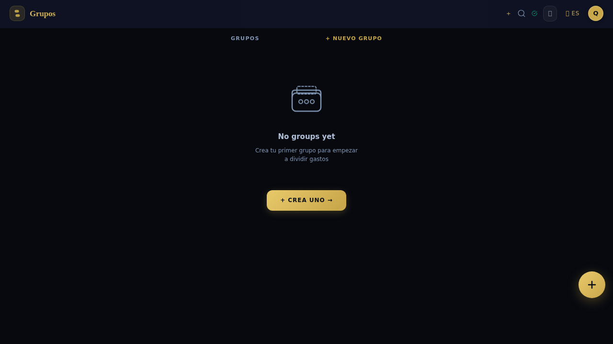

# Splitrr — Self-hosted expense splitter

**Splitrr** is a privacy-first expense sharing app you run on your own server. No subscriptions, no ads, no data leaving your machine — just a clean way to split bills with friends and family.

> **Stack:** SvelteKit 2 + SQLite · **PWA:** fully offline capable · **Deploy:** Home Assistant, Docker, or any Node.js host

[](LICENSE)
[](https://github.com/jsr1292/split/releases)
[](https://github.com/jsr1292/split/pkgs/container/splitrr)

---

## Screenshots

| Login | Dashboard | Groups | People |
|:-----:|:---------:|:------:|:------:|
|  |  |  |  |

---

## Features

### Core
- **Multi-currency** — Record expenses in any of 33 currencies. Balances convert to each person's base currency at the ECB rate on the day.
- **Debt simplification** — Greedy algorithm finds the minimum number of transfers needed to settle up.
- **Recurring expenses** — Weekly, monthly, or yearly. Split auto-generates the next 12 instances.
- **Item-level splitting** — Add individual line items (pizza, wine, dessert) and assign each to specific people.
- **Partial settlements** — Settle up for any amount, not just the full balance.

### UX
- **Offline PWA** — Add expenses without internet. The service worker queues them in IndexedDB and syncs when back online.
- **EN / ES** — Full Spanish and English. Toggle in the header.
- **Three themes** — Dark glassmorphism (default), OLED true black, warm light.
- **Pull-to-refresh** — Pull down on any list to sync fresh data.
- **Invite links** — Share a `/groups/{id}/join` link. Anyone joins instantly.
- **CSV export** — Download a group's full expense history.

### Technical
- **SQLite** — Zero-configuration database, backed up like any file.
- **Self-hosted fonts** — JetBrains Mono + Libre Baskerville. No Google Fonts, no external dependencies.
- **Offline-first service worker** — Network-first for pages, cache-first for assets.
- **33 currencies** — EUR, GBP, USD, CHF, JPY, CAD, AUD, NZD, SEK, NOK, DKK, PLN, CZK, HUF, RON, BGN, HRK, TRY, BRL, MXN, CNY, INR, KRW, THB, SGD, HKD, ZAR, AED, ILS, PHP, TWD, MYR, IDR

---

## Quick Start

```bash
git clone https://github.com/jsr1292/split.git
cd split
npm install
npm run dev
```

Open [http://localhost:3480](http://localhost:3480), create your account, start splitting.

---

## Home Assistant Add-on

The easiest way to run Splitrr. Install via your Home Assistant addon repository:

1. Add `https://github.com/jsr1292/split` as an addon repository
2. Find **Splitrr** in the add-on store
3. Install and start — Ingress enabled for direct embedding

Data persists in HA's `/config` volume. No port forwarding needed.

---

## Docker

```bash
# Build and run
docker build -t splitrr .
docker run -d -p 3480:3480 -v $(pwd)/data:/data splitrr

# Or pull pre-built image
docker run -d -p 3480:3480 -v $(pwd)/data:/data \
  ghcr.io/jsr1292/splitrr:main
```

### Environment Variables

| Variable | Default | Description |
|----------|---------|-------------|
| `PORT` | `3480` | Server port |
| `DATA_DIR` | `./data/` | SQLite DB directory |
| `NODE_ENV` | `development` | Set to `production` |

---

## Tech Stack

| Layer | Choice |
|-------|--------|
| UI | SvelteKit 2 (Svelte 5) |
| Database | SQLite + better-sqlite3 |
| Auth | Session cookies + scrypt |
| Styling | Pure CSS — dark glassmorphism + gold accents |
| i18n | JSON-based, EN/ES |
| Fonts | Self-hosted (JetBrains Mono, Libre Baskerville) |
| PWA | Service worker + IndexedDB offline queue |
| CI/CD | GitHub Actions · multi-arch (amd64, arm64) → GHCR |

---

## License

MIT — see [LICENSE](LICENSE)
